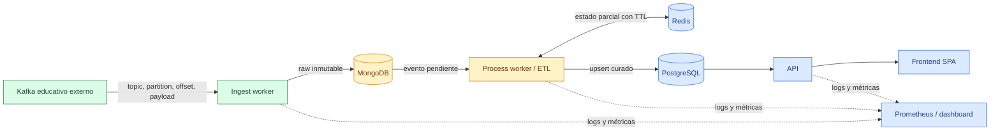
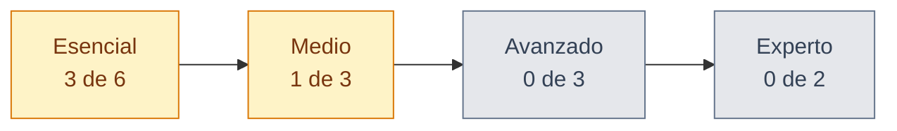

# HR Pro Data Platform

Plataforma de ingeniería de datos en tiempo real para convertir eventos heterogéneos
de RR. HH. en información trazable, integrada y consultable. El proyecto conserva la
evidencia original en MongoDB, construye una vista curada en PostgreSQL y evoluciona
por niveles hasta ofrecer monitorización, API y frontend.

[](https://github.com/Bootcamp-IA-MAD-P7/Proyecto-DataEngineer-Grupo1/actions/workflows/ci.yml)
[](https://github.com/Bootcamp-IA-MAD-P7/Proyecto-DataEngineer-Grupo1/actions/workflows/pr-governance.yml)
[](pyproject.toml)
[](https://github.com/Bootcamp-IA-MAD-P7/Proyecto-DataEngineer-Grupo1/tree/develop)
[](docs/04-sdd-workflow.md)
[](#estado-frente-al-briefing)

> Convertimos evidencia de Kafka en contratos, contratos en software comprobable y
> software comprobable en una demo que puede explicarse de principio a fin.

## Resumen ejecutivo

HR Pro necesita unificar cinco tipos de información que llegan de forma fragmentada:
datos personales, ubicación, información profesional, bancaria y de red. La solución
se diseña como un flujo continuo y recuperable:

1. Kafka transporta los eventos producidos por el entorno educativo externo.
2. El worker de ingesta conserva cada mensaje original y sus metadatos en MongoDB.
3. El proceso ETL clasifica, valida y agrupa fragmentos sin perder trazabilidad.
4. PostgreSQL publica el modelo curado para consultas, API y frontend.
5. Redis y Prometheus se incorporan cuando el flujo esencial ya es correcto.

El proyecto no presupone el contenido de los mensajes. El contrato inicial se obtuvo
mediante observación limitada y revisada del broker, sin consultar el código del
generador y sin versionar datos personales.

## Estado verificable — 31 de agosto de 2026

| Capacidad | Estado | Evidencia | Límite actual |
|---|---|---|---|
| Gobernanza Git y CI | Operativa | Ruleset, CODEOWNERS y workflows; último `quality` verde en `develop` | Toda PR sigue necesitando revisión humana |
| Observación Kafka | Completada | HRP-29 y documento de observación seguro | Muestra acotada; no demuestra semántica |
| Contrato inicial | Completado | HRP-24, integrada mediante PR #12 | Correlación y reglas de negocio pendientes |
| Consumer configurable | Completado | HRP-30, tests unitarios y configuración por entorno | No persiste ni transforma payloads |
| Consumo continuo | Completado | HRP-31, integrada mediante PR #14 | Validación de runtime, no prueba E2E |
| MongoDB local | Completado | HRP-33 y PR #27 | Servicio local, cliente MongoDB e índices técnicos disponibles |
| Persistencia raw | Implementada en la rama HRP-34, revisión pendiente | HRP-34 y pruebas unitarias/integración MongoDB real | No está mergeada; Kafka real-broker E2E no ejecutado |
| Duplicados técnicos | Completado | HRP-36, índice único y tests de `BulkWriteError` | Es deduplicación Kafka, no deduplicación de personas |
| Errores técnicos | Completado | HRP-37, manejo de errores permanentes/transitorios | Falta observabilidad completa del pipeline |
| Análisis de correlación | En curso | HRP-43 | Debe analizar candidatos y decidir si existe evidencia suficiente |
| Clasificación de variantes | En curso | HRP-44 | Debe formalizar el mapping sin inventar semántica |
| Validación y limpieza | En curso | HRP-45 | Reglas de negocio y normalización pendientes |
| Modelo PostgreSQL | Completado como diseño | HRP-25, HRP-52, PRs #18, #19 y #28 | La implementación SQL aún no existe |
| Pipeline completo | Pendiente | — | No debe presentarse todavía como funcional |

La suite actual contiene **17 tests**, alcanza **80.10 % de cobertura de línea** y
mantiene un umbral automático del **75 %**. El último workflow `quality` en `develop`
pasó `validate_specs.py`, `pre-commit`, Ruff, formato, mypy, pytest y validación de
Compose sobre el commit `0942230`.

## Lo que ya puede verse funcionando

Hoy se puede demostrar, de manera honesta y reproducible:

- carga de configuración Kafka desde variables de entorno;
- suscripción a una lista autorizada de topics;
- polling continuo, manejo de errores y cierre limpio;
- logs técnicos sin payloads ni datos personales;
- MongoDB local aislado y saludable mediante Docker Compose;
- cliente MongoDB con `ping`, índices técnicos y control de duplicados por coordenadas;
- persistencia inicial de fragmentos válidos en MongoDB desde el consumer;
- lint, formato, tipos, tests, cobertura, validación de specs y de Compose en CI;
- trazabilidad `Jira -> spec -> código/documento -> PR -> revisión -> evidencia`.

Todavía no se puede demostrar un perfil completo en PostgreSQL ni una consulta desde
API o frontend. Antes de vender el flujo como final, también hay que revisar que el
La implementación de HRP-34 ya preserva el topic Kafka original, partición, offset,
payload y estado de procesamiento sin confundirlos con la clasificación del fragmento;
la revisión humana de la corrección sigue pendiente.

## Arquitectura



### Seguridad del dato y seguimiento pendiente

ADR-0005 propone que el consumer no confirme un offset solo por haber recibido el
mensaje. La implementación de HRP-34/36 ya introduce persistencia MongoDB, índice
único y comportamiento idempotente inicial. Antes de aceptar esta política como
invariante final del pipeline, el equipo debe comprobar que MongoDB:

- inserte el documento raw, o
- demuestre que ese mismo `topic + partition + offset` ya estaba persistido.

Un fallo de MongoDB debe dejar el offset sin confirmar para permitir reentrega. La
política pretende evitar pérdida silenciosa. El seguimiento técnico vive en
[ADR-0005](docs/adr/0005-kafka-acknowledgement-after-raw-persistence.md) y en las
ADR-0005 permanece `Proposed` hasta la revisión humana de Miguel.

### Sobre raw mínimo

```json
{
  "payload": "<objeto original sin normalizar>",
  "topic": "<metadato Kafka>",
  "partition": 0,
  "offset": 0,
  "received_at": "<UTC>",
  "processing_status": "pending"
}
```

El ejemplo expresa la propuesta de estructura, no datos reales. La combinación
`topic + partition + offset` se utiliza como identidad técnica e índice único en HRP-34;
la política definitiva sigue sujeta a revisión humana.

## Evidencia Kafka disponible

La observación autorizada de HRP-29 registró únicamente estructura agregada:

| Dimensión | Resultado observado |
|---|---|
| Topic de la muestra | `probando` |
| Particiones | 1 |
| Mensajes analizados en memoria | 20 |
| Objetos JSON válidos | 20 |
| Variantes estructurales | 5 |
| Errores técnicos | 0 |

Se observaron diferencias relevantes respecto a nombres provisionales, entre ellas
`last_name`, `company address`, `company_email` e `IPv4`. `sex` apareció como array y
`salary` como string. Esto describe forma aparente, no formato de negocio ni reglas de
normalización. Las cinco variantes A–E siguen siendo etiquetas técnicas neutrales.

La evidencia completa, sin valores de payload, está en
[docs/observations/2026-08-27-HRP-29-kafka.md](docs/observations/2026-08-27-HRP-29-kafka.md).

## Estado frente al briefing

**Última revisión:** 2026-08-31

Esta matriz reproduce todos los requisitos de entrega. Un requisito solo figura como
completado cuando existe evidencia versionada o una demostración reproducible. Un
servicio arrancado, una spec o un diseño por sí solos cuentan como trabajo en curso.

### Resumen visual

| Bloque evaluado | Progreso | Cumplidos | Situación |
|---|---:|---:|---|
| Condiciones de entrega | `████░░░░░░` | 2/5 | [![En curso][status-active]][status-active-link] |
| Nivel esencial | `█████░░░░░` | 3/6 | [![En curso][status-active]][status-active-link] |
| Nivel medio | `███░░░░░░░` | 1/3 | [![En curso][status-active]][status-active-link] |
| Nivel avanzado | `░░░░░░░░░░` | 0/3 | [![Pendiente][status-pending]][status-pending-link] |
| Nivel experto | `░░░░░░░░░░` | 0/2 | [![Pendiente][status-pending]][status-pending-link] |

> Los contadores solo incluyen requisitos completamente demostrados. Los requisitos
> en curso aparecen detallados abajo y no se redondean como terminados.

### Condiciones de entrega

| Check literal | Estado | Evidencia disponible | Qué falta |
|---|---|---|---|
| Repositorio en GitHub con código fuente documentado | [![Completado][status-done]][status-done-link] | Repositorio, README, specs, ADRs, CI y gobernanza | Mantenerlo actualizado hasta la entrega |
| Programa Dockerizado conectado a Kafka, con procesamiento, MongoDB y SQL | [![En curso][status-active]][status-active-link] | Consumer Kafka y MongoDB local | Integrar persistencia raw, ETL, PostgreSQL y Compose completo |
| Demo en vivo de la aplicación | [![En curso][status-active]][status-active-link] | Demo parcial de Kafka, consumer y MongoDB local | Demostrar el recorrido completo hasta consulta final |
| Presentación técnica de objetivos, desarrollo y tecnologías | [![En curso][status-active]][status-active-link] | [`docs/presentation-sources/`](docs/presentation-sources/README.md) y DAFO evolutivo | Preparar deck final y ensayar la exposición |
| Tablero Kanban para gestionar el proyecto | [![Completado][status-done]][status-done-link] | [Proyecto HRP en Jira](https://redondonunezmiguel.atlassian.net/jira/software/projects/HRP/boards/1) | Mantener estados, dependencias y cierres al día |

### Nivel esencial

| Check literal | Estado | Evidencia actual | Próxima prueba de cierre |
|---|---|---|---|
| Consumer Kafka en tiempo real y miles de mensajes por segundo | [![En curso][status-active]][status-active-link] | HRP-30 y HRP-31: consumer configurable y continuo validado | Medición de carga sostenida y tasa de mensajes |
| Persistir los mensajes Kafka en MongoDB | [![Completado][status-done]][status-done-link] | HRP-34 y pruebas unitarias/integración MongoDB real | Revisión humana antes del merge |
| Agrupar Personal, Location, Professional, Bank y Net Data por persona | [![En curso][status-active]][status-active-link] | Contrato HRP-24; análisis HRP-43 activo | Analizar candidatos en HRP-43; solo después, y si hay evidencia, definir correlación; HRP-44 clasifica y HRP-45 valida/limpia |
| Persistir los datos agrupados en una base SQL | [![En curso][status-active]][status-active-link] | Diseño PostgreSQL HRP-25 activo | Esquema, migración, upsert y consulta de validación |
| Ramas organizadas y commits limpios | [![Completado][status-done]][status-done-link] | `develop`, PRs, CODEOWNERS, ruleset y títulos con Jira | Mantener la política en todas las contribuciones |
| Código documentado y README en GitHub | [![Completado][status-done]][status-done-link] | README, arquitectura, runbook, specs, dailies y fuentes de presentación | Actualización continua con cada hito funcional |

### Nivel medio

| Check literal | Estado | Evidencia actual | Próxima prueba de cierre |
|---|---|---|---|
| Sistema de logs | [![En curso][status-active]][status-active-link] | Logs técnicos seguros del consumer y política de observabilidad | Logs estructurados del pipeline completo y errores de persistencia |
| Tests unitarios | [![Completado][status-done]][status-done-link] | 17 tests, cobertura medida del 80.10 % y umbral CI del 75 % | Ampliar pruebas con cada comportamiento nuevo |
| Aplicación Dockerizada con Docker Compose | [![En curso][status-active]][status-active-link] | Compose de MongoDB validado en CI | Añadir aplicación, PostgreSQL y configuración integral |

### Nivel avanzado

| Check literal | Estado | Evidencia actual | Próxima prueba de cierre |
|---|---|---|---|
| Redis como almacenamiento intermedio en caché | [![Pendiente][status-pending]][status-pending-link] | Arquitectura objetivo y responsabilidades definidas | Estado parcial con TTL y prueba de recuperación |
| Monitorización de consumo, velocidad, procesamiento y persistencia | [![Pendiente][status-pending]][status-pending-link] | Catálogo inicial de métricas | Prometheus, métricas reales y dashboard reproducible |
| API de consulta sobre la base SQL | [![Pendiente][status-pending]][status-pending-link] | Límite de API definido en arquitectura | Endpoints, validación, tests y consultas PostgreSQL |

### Nivel experto

| Check literal | Estado | Evidencia actual | Próxima prueba de cierre |
|---|---|---|---|
| Actualización continua de las bases mientras Kafka publica | [![Pendiente][status-pending]][status-pending-link] | Consumer continuo validado, sin persistencia conectada | Demo prolongada Kafka -> MongoDB -> PostgreSQL sin intervención |
| Frontend sencillo para consultar clientes | [![Pendiente][status-pending]][status-pending-link] | React + TypeScript + Vite es la dirección preferida; Streamlit solo fallback de demo | Buscador, resultados, métricas accesibles y conexión exclusiva mediante API |

### Tecnologías del briefing

| Tecnología recomendada | Adopción | Uso actual |
|---|---|---|
| Git / GitHub | [![Completado][status-done]][status-done-link] | Repositorio, PRs, revisión, CI, tags y gobernanza |
| Docker / Docker Compose | [![En curso][status-active]][status-active-link] | MongoDB local; stack de aplicación pendiente |
| Python | [![Completado][status-done]][status-done-link] | Consumer y arnés en Python 3.11 |
| Kafka | [![En curso][status-active]][status-active-link] | Conexión, consumo continuo y persistencia raw HRP-34 | Rendimiento y E2E con broker real pendientes |
| Pandas | [![Opcional][status-optional]][status-optional-link] | No se añade hasta que una necesidad ETL justifique la dependencia |
| MongoDB | [![En curso][status-active]][status-active-link] | Servicio local y persistencia raw HRP-34 disponibles | Evolución posterior del pipeline pendiente |
| PostgreSQL | [![En curso][status-active]][status-active-link] | Modelo HRP-25 en desarrollo; servicio y persistencia pendientes |
| Jira | [![Completado][status-done]][status-done-link] | Backlog, responsables, estados y dependencias del proyecto |



[status-done]: https://img.shields.io/badge/COMPLETADO-2E7D32?style=flat-square
[status-active]: https://img.shields.io/badge/EN%20CURSO-D97706?style=flat-square
[status-pending]: https://img.shields.io/badge/PENDIENTE-64748B?style=flat-square
[status-optional]: https://img.shields.io/badge/OPCIONAL-2563EB?style=flat-square
[status-done-link]: #estado-frente-al-briefing
[status-active-link]: #estado-frente-al-briefing
[status-pending-link]: #estado-frente-al-briefing
[status-optional-link]: #tecnologías-del-briefing

## Cómo trabajamos: SDD y arnés de ingeniería

El repositorio aplica **Specification-Driven Development**: la tarea no empieza por
generar código, sino por concretar qué problema resuelve, qué queda fuera, cómo se
demuestra y qué decisiones siguen pendientes.

```text
Jira
  -> paquete de tarea y contexto autorizado
  -> spec con criterios de aceptación
  -> rama aislada
  -> cambio mínimo y tests
  -> arnés automático
  -> pull request
  -> revisión humana
  -> merge y evidencia de cierre
  -> Jira
```

El **arnés** es el conjunto de controles que hace repetible esa forma de trabajar:

| Capa | Artefactos | Función |
|---|---|---|
| Guía | `AGENTS.md`, arquitectura, contrato, ADRs | Impide que una IA o persona invente contexto |
| Especificación | `docs/specs/HRP-*.md` | Convierte Jira en alcance y aceptación comprobables |
| Aislamiento | Rama por tarea y Compose local | Limita el impacto del cambio |
| Sensores | pre-commit, Ruff, mypy, pytest, cobertura, CI | Detecta fallos antes del merge |
| Evidencia | PR, revisión, daily y comentario Jira | Permite auditar por qué se cerró una tarea |

La IA propone y acelera; una persona aprueba contrato, arquitectura, PR y cierre. La
guía práctica y los prompts reutilizables están en
[docs/onboarding/ai-assisted-workflow.md](docs/onboarding/ai-assisted-workflow.md).

## Inicio rápido

### 1. Clonar y preparar Python

```powershell
git clone https://github.com/Bootcamp-IA-MAD-P7/Proyecto-DataEngineer-Grupo1.git
cd Proyecto-DataEngineer-Grupo1
git switch develop
git pull --ff-only
python -m venv .venv
.\.venv\Scripts\Activate.ps1
python -m pip install --upgrade pip
python -m pip install -e ".[dev]"
pre-commit install
```

### 2. Validar la base del proyecto

```powershell
pre-commit run --all-files
python scripts/validate_specs.py
ruff check .
ruff format --check .
mypy src
pytest
docker compose -f infra/compose.dev.yml config --quiet
```

### 3. Arrancar MongoDB local

```powershell
docker compose -f infra/compose.dev.yml up -d mongo
docker compose -f infra/compose.dev.yml ps
docker compose -f infra/compose.dev.yml exec -T mongo `
  mongosh --quiet --eval "db.adminCommand('ping').ok"
```

Para detenerlo sin borrar el volumen:

```powershell
docker compose -f infra/compose.dev.yml down
```

### 4. Construir la imagen de la aplicación

El Dockerfile empaqueta únicamente el consumer Python existente. La configuración se
inyecta en tiempo de ejecución mediante variables de entorno; la imagen no incluye
`.env`, secretos, Kafka educativo ni servicios de base de datos.

```powershell
docker build --tag hr-pro-platform:local .
```

Este build no sustituye al Compose final del proyecto. La ejecución integrada con
MongoDB, PostgreSQL y los demás servicios se implementará en tareas posteriores.

### 5. Configurar el consumer

Copia `.env.example` como `.env` y completa únicamente valores autorizados. Las
variables de proceso tienen prioridad y `.env` nunca se versiona.

```dotenv
KAFKA_BOOTSTRAP_SERVERS=localhost:29092
KAFKA_CONSUMER_GROUP=hr-pro-local
KAFKA_TOPICS=probando
```

#### Catálogo de configuración

`.env.example` es la plantilla versionada; `.env` es local y puede contener secretos.
No copies su contenido a Git, logs, Jira, PRs, chats ni material de presentación. El
consumer actual carga el archivo local sin sobrescribir valores ya definidos por el
proceso.

| Variable | Uso | Estado actual | Regla de seguridad |
|---|---|---|---|
| `KAFKA_BOOTSTRAP_SERVERS` | Dirección del broker autorizado | Consumida por el consumer Kafka | Configurar solo de forma local o por entorno de ejecución |
| `KAFKA_TOPICS` | Lista separada por comas de topics autorizados | Consumida por el consumer Kafka | No fijar topics en código; no incluir payloads |
| `KAFKA_CONSUMER_GROUP` | Identificador del grupo Kafka | Consumida por el consumer Kafka | Usar un nombre operativo local o de despliegue |
| `MONGODB_URI` | Conexión al almacenamiento raw | Reservada para persistencia raw | Puede contener credenciales; nunca versionarla |
| `POSTGRES_DB` | Nombre de base curada | Reservada para PostgreSQL | Valor local/de despliegue, no una regla de negocio |
| `POSTGRES_USER` | Usuario de PostgreSQL | Reservada para PostgreSQL | Nunca versionar credenciales reales |
| `POSTGRES_PASSWORD` | Contraseña de PostgreSQL | Reservada para PostgreSQL | Mantener exclusivamente fuera de Git |
| `REDIS_URL` | Conexión al estado temporal | Reservada para Redis | Puede contener credenciales; nunca versionarla |
| `LOG_LEVEL` | Nivel de detalle operativo | Reservada para logging estructurado | Los logs nunca exponen secretos ni payloads |

Las variables reservadas describen el contrato operativo objetivo; no significan que
los servicios o sus consumidores de configuración estén implementados todavía.

```powershell
python -m hr_pro_platform.ingestion.main
```

Detén el consumer con `Ctrl+C`. Sus logs solo deben mostrar topic, partición, offset,
tamaño y tipo de error; nunca el payload.

## Entorno Kafka educativo

Kafka vive fuera del repositorio del equipo. El entorno autorizado puede ejecutarse
en una carpeta independiente siguiendo su documentación pública:

```powershell
git clone https://github.com/Factoria-F5-madrid/data-engineering-educational-project.git kafka-educational-runtime
cd kafka-educational-runtime
docker compose up --build -d
docker compose ps
```

### Restricción no negociable

El código que genera los datos es una caja negra. No se abre, lee, inspecciona,
busca, analiza ni se usa para inferir el contrato. Las fuentes autorizadas son el
briefing público y los mensajes recibidos del broker mediante observaciones limitadas
y seguras. Nunca se incluyen payloads, PII, secretos o contenido de `.env` en Git,
Jira, PRs, chats o presentaciones.

## Calidad y automatización

| Control | Ejecución | Propósito |
|---|---|---|
| Spec validator | Cada PR | Comprueba estructura mínima de specs |
| Ruff lint y format | Local y CI | Mantiene código consistente y sin errores mecánicos |
| mypy strict | Local y CI | Verifica contratos de tipos en `src` |
| pytest + coverage | Local y CI | Exige comportamiento probado y suelo del 75 % |
| Compose config | CI | Detecta configuración Docker inválida |
| PR governance | Cada PR | Exige clave Jira y título convencional |
| PR labels | Cada PR | Clasifica automáticamente el área del cambio |
| CODEOWNERS + aprobación | Antes del merge | Mantiene revisión humana independiente |
| Release tags | Bajo workflow | Permite entregas reproducibles y auditables |

La matriz completa de pruebas incluye unitarias, contrato, integración, E2E y carga:
[docs/05-test-harness.md](docs/05-test-harness.md).

## Equipo y propiedad

| Persona | Rol principal | Foco actual |
|---|---|---|
| Miguel | Plataforma, arquitectura y calidad | CI, Docker, documentación, observabilidad y demo |
| Anahí | Ingesta y raw storage | Kafka, consumer, MongoDB e idempotencia raw |
| Gaby | Contrato y transformación | Clasificación, limpieza, agrupación, Redis y métricas |
| Johans | Modelo curado y serving | PostgreSQL, consultas, API y frontend |

La propiedad no crea silos: toda PR necesita revisión de otra persona y los cambios
en límites de componentes se revisan con el área afectada.

## Estructura del repositorio

```text
.
├── .github/                  Workflows, plantilla de PR y CODEOWNERS
├── docs/
│   ├── adr/                  Decisiones arquitectónicas duraderas
│   ├── ai/                   Paquetes de tarea y política de asistencia supervisada
│   ├── dailies/              Evolución diaria, acuerdos y bloqueos
│   ├── observations/         Evidencia estructural segura
│   ├── presentation-sources/ Fuentes curadas para NotebookLM
│   └── specs/                Contrato ejecutable de cada tarea Jira
├── infra/                    Compose y futura observabilidad
├── scripts/                  Automatización reproducible
├── src/hr_pro_platform/      Aplicación Python modular
├── tests/                    Unitarias, fixtures y futuras integraciones/E2E
├── AGENTS.md                 Reglas de contexto para asistentes
├── CONTRIBUTING.md           Flujo Git y Definition of Done
└── pyproject.toml            Dependencias y configuración Python canónica
```

## Próximos cortes verticales

1. **Revisar sobre raw y frontera ETL.** Confirmar mediante revisión humana que
   HRP-34 preserve claramente el topic Kafka original, partición, offset, payload,
   clasificación técnica y estado de procesamiento antes de usarlo como entrada del
   ETL.
2. **Análisis de correlación.** HRP-43 compara con evidencia autorizada los candidatos
   `passport`, `fullname` y `address`, documenta coincidencias, ambigüedades y
   conflictos y determina si es seguro proponer una estrategia. Si la evidencia no es
   suficiente, la correlación permanece explícitamente pendiente.
3. **Clasificación y calidad.** Resolver HRP-44 para clasificar las variantes y HRP-45
   para validarlas y limpiarlas con reglas exactas y fixtures sanitizados.
4. **Fragmentos -> persona curada.** Gestionar orden e
   incompletitud y publicar mediante upsert en PostgreSQL.
5. **Operación reproducible.** Completar Compose de aplicación, logs estructurados,
   integración y E2E.
6. **Observabilidad y producto.** Añadir Redis, Prometheus, API y frontend accesible
   cuando el flujo esencial ya tenga una referencia estable.

## Frontera raw de HRP-34

Todo JSON object parseable, incluidos `unknown` y `non-conforming`, se persiste en
`raw_events` antes de clasificación o validación. Los fallos técnicos se enrutan a
`invalid_events` con `missing_value`, `invalid_utf8`, `invalid_json` o
`non_object_json`; `None` usa `payload: null` y los bytes inválidos son BSON Binary
solo dentro de MongoDB. La identidad es `topic + partition + offset`; los conflictos
no permiten acknowledgement y los offsets avanzan solo por el prefijo durable
contiguo de cada topic-partition. Las colecciones se configuran con
`MONGODB_COLLECTION` y `MONGODB_INVALID_COLLECTION`. La colección incompatible
existente permanece sin cambios.

## Diferenciales del proyecto

- **Evidence-first:** el contrato nace del broker observado, no de conocer el
  generador ni de adivinar nombres.
- **Pérdida de datos tratada antes de implementar:** el límite de confirmación Kafka
  se formula como propuesta revisable y solo se aprobará con evidencia de HRP-34.
- **Documentación ejecutable:** specs, tests y CI reducen la distancia entre lo escrito
  y lo que realmente puede demostrarse.
- **Asistencia IA supervisada:** todos usan el mismo contexto, restricciones y criterios,
  pero ninguna IA aprueba su propio trabajo ni cierra Jira.
- **Presentación construida durante el proyecto:** las fuentes de NotebookLM contienen
  evidencia y evolución, no una reconstrucción apresurada al final.

También mantenemos un [DAFO evolutivo](docs/09-evolving-swot.md) y un
[benchmark documentado](docs/10-reference-benchmark.md). La referencia externa se
usa solo para aprender patrones; no es dependencia ni fuente de contrato y no se copia
su código.

## Índice documental

| Necesidad | Fuente canónica |
|---|---|
| Objetivo, alcance y niveles | [Project charter](docs/00-project-charter.md) |
| Componentes, límites y flujo | [Arquitectura](docs/01-architecture.md) |
| Hechos observados e incógnitas | [Contrato de datos](docs/02-data-contract.md) |
| Raw y modelo curado | [Modelo de datos](docs/03-data-model.md) |
| Flujo Specification-Driven | [SDD](docs/04-sdd-workflow.md) |
| Pruebas y quality gates | [Test harness](docs/05-test-harness.md) |
| Logs, métricas y privacidad | [Observabilidad](docs/06-observability.md) |
| Accesibilidad y sostenibilidad | [ADR-0007](docs/adr/0007-accessibility-and-sustainable-delivery.md) |
| Arranque y diagnóstico | [Runbook](docs/07-runbook.md) |
| Ramas, PRs y releases | [Gobernanza Git](docs/08-git-governance.md) |
| Fortalezas y riesgos vivos | [DAFO evolutivo](docs/09-evolving-swot.md) |
| Aprendizaje de referencia | [Benchmark](docs/10-reference-benchmark.md) |
| Trabajo diario | [Dailies](docs/dailies/README.md) |
| Presentación técnica | [Fuentes NotebookLM](docs/presentation-sources/README.md) |
| Onboarding y prompts | [Trabajo asistido por IA](docs/onboarding/ai-assisted-workflow.md) |

## Guion de demo final

La demo contará el viaje de un dato, no una lista de herramientas:

1. Mostrar servicios saludables sin abrir el generador educativo.
2. Recibir eventos en Kafka con logs exclusivamente técnicos.
3. Comprobar raw e idempotencia en MongoDB.
4. Mostrar clasificación, agrupación y auditoría del ETL.
5. Consultar la persona curada en PostgreSQL, API y frontend accesible.
6. Mostrar métricas de consumo, latencia, persistencia y errores.
7. Cerrar con CI, PR revisadas, Jira y evolución del DAFO como evidencia del proceso.

Hasta que todos esos pasos existan, el README distingue claramente entre lo
**completado**, lo **en curso** y lo **planificado**.
