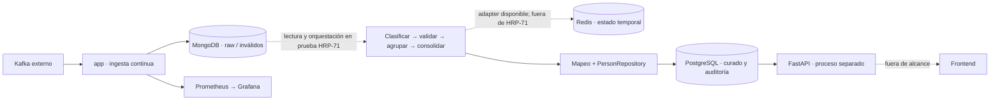

# HR Pro Data Platform

**De eventos fragmentados a información trazable y consultable.**

Plataforma educativa de ingeniería de datos para RR. HH.: ingesta Kafka, conservación
raw en MongoDB, clasificación y consolidación de cinco dominios, persistencia
PostgreSQL, estado temporal Redis y consultas FastAPI. Prometheus y Grafana hacen
visible el comportamiento de la ingesta.

[](https://github.com/Bootcamp-IA-MAD-P7/Proyecto-DataEngineer-Grupo1/actions/workflows/ci.yml)
[](pyproject.toml)
[](docs/README.md)

**Corte documental:** 8 de septiembre de 2026.
**Referencia remota comprobada:** `275131a` en `develop`; implementación técnica
hasta `f3a952b`. La PR #80 integró la primera documentación de cierre; esta revisión
la completa. El badge de CI es dinámico, no una certificación de esta revisión.

[Inicio rápido](#inicio-rápido) · [Arquitectura](#arquitectura-y-ejecución-real) ·
[API](docs/api-reference.md) · [Documentación](docs/README.md) ·
[NotebookLM](docs/presentation-sources/README.md) · [Cierre](docs/project-closeout.md)

## Qué resuelve

Los eventos llegan por fragmentos: Personal, Location, Professional, Bank y Net.
La solución conserva su procedencia, identifica estructuras conocidas y construye
componentes operativos de persona sin ocultar ambigüedades. Una coincidencia entre
campos no se presenta como prueba de identidad real.

| Decisión | Aplicación |
|---|---|
| Conservar antes de interpretar | MongoDB mantiene payload y coordenadas Kafka |
| Separar identidad técnica y de negocio | El offset identifica el evento; ADR-0006 limita la correlación |
| Preservar incertidumbre | Consolidación `complete`, `incomplete`, `ambiguous` y entradas no resueltas |
| Consultar datos curados | FastAPI consulta PostgreSQL; búsquedas sin datos bancarios |
| Explicar con evidencia | Specs, PRs, pruebas, dailies y bibliografía enlazadas |

## Estado frente al briefing

La siguiente matriz registra la **aceptación de cierre comunicada por Miguel,
responsable del proyecto**: todos los checks salvo el frontend.
Estos porcentajes describen aceptación, no cobertura de tests, throughput ni
certificación independiente de funcionamiento.

| Bloque | Aceptados | Progreso de aceptación | Alcance |
|---|---:|---|---|
| Condiciones de entrega | 5/5 | ██████████ 100 % | Aceptación del responsable |
| Esencial | 6/6 | ██████████ 100 % | Aceptación del responsable |
| Medio | 3/3 | ██████████ 100 % | Aceptación del responsable |
| Avanzado | 3/3 | ██████████ 100 % | Aceptación del responsable |
| Experto | 1/2 | █████░░░░░ 50 % | Frontend excluido del cierre |

**18 de 19 checks aceptados; un check excluido.**
La [matriz detallada](docs/delivery-evidence.md) enumera los 19 requisitos,
sus artefactos y los límites de verificación. No se descuentan incidencias de
entorno como si fueran trabajo funcional no realizado.

### Capacidades verificables

| Capacidad | Estado de cierre | Evidencia principal | Límite declarado |
|---|---|---|---|
| Gobernanza Git y CI | Operativa | Workflows, CODEOWNERS, plantillas y reglas de PR | Revisión humana y checks remotos siguen siendo obligatorios |
| Observación Kafka | Completada | HRP-29, observaciones y contrato inicial | Muestra acotada; no demuestra semántica universal |
| Contrato de datos | Integrado | HRP-24, HRP-44, HRP-45 y ADR-0003 | Clasificador por claves, no por significado de negocio |
| Consumer Kafka | Integrado | HRP-30/31, configuración y pruebas | Requiere broker autorizado; no se adjunta benchmark de throughput |
| Persistencia raw MongoDB | Integrada | HRP-34, repositorios e índices técnicos | Deduplicación por coordenadas/evento, no por persona |
| Clasificación y agrupación | Integrada | HRP-43 a HRP-51, ADR-0006 | Correlación conservadora; mantiene ambigüedad |
| Persistencia SQL | Integrada | HRP-52 a HRP-60, esquema y repositorio | Inicializador no es framework de migraciones |
| Redis temporal | Integrado | HRP-73 a HRP-76 | Estado efímero con TTL; no fuente de verdad |
| API SQL | Integrada | HRP-83 a HRP-86 | Sin autenticación y sin frontend |
| Observabilidad | Integrada | HRP-77 a HRP-82, Prometheus y Grafana | Tres métricas de ingesta; sin SLO ni percentiles reales finitos |
| Pipeline completo | Parcialmente orquestado | HRP-71 sintético y componentes versionados | No hay worker continuo MongoDB -> SQL en producción |
| Presentación y cierre | Preparado | Dailies, fuentes NotebookLM y auditoría HRP-93 | Fuentes listas; no deck final generado en este repo |

### Detalle literal por nivel

| Nivel | Check | Estado de cierre | Evidencia | Límite |
|---|---|---|---|---|
| Entrega | Repositorio GitHub documentado | Aceptado | README, docs, specs, ADRs y CI | Debe revisarse tras cada merge |
| Entrega | Programa Dockerizado con Kafka, MongoDB y SQL | Aceptado | Dockerfile y Compose | SQL no se alimenta por un worker continuo del servicio `app` |
| Entrega | Demo en vivo | Aceptado | Runbook y fuentes de demo | No se adjunta grabación |
| Entrega | Presentación técnica | Aceptado | `docs/presentation-sources/` | NotebookLM debe generar el deck |
| Entrega | Tablero Kanban | Aceptado | Jira HRP | Estados remotos no modificados por esta revisión |
| Esencial | Consumer Kafka en tiempo real | Aceptado | HRP-30/31 | Sin benchmark de miles de mensajes por segundo |
| Esencial | Persistir mensajes Kafka en MongoDB | Aceptado | HRP-34 | Requiere MongoDB disponible |
| Esencial | Agrupar cinco dominios por persona | Aceptado | HRP-43 a HRP-51 | No prueba identidad real universal |
| Esencial | Persistir agrupados en SQL | Aceptado | HRP-52 a HRP-60 | Modelo curado técnico, no enriquecimiento externo |
| Esencial | Ramas organizadas y commits limpios | Aceptado | Gobernanza Git | La PR debe seguir checks remotos |
| Esencial | Código documentado y README | Aceptado | HRP-26/93 | Documentación viva |
| Medio | Sistema de logs | Aceptado | HRP-65 a HRP-67 | Logs genéricos no tienen filtro universal de excepciones |
| Medio | Tests unitarios | Aceptado | 307 tests colectados; cobertura 82,91 % | Último intento local no está verde |
| Medio | Docker Compose | Aceptado | `infra/compose.dev.yml` | No incluye broker Kafka ni API como servicio |
| Avanzado | Redis como caché intermedia | Aceptado | HRP-73 a HRP-76 | No persistente |
| Avanzado | Monitorización | Aceptado | HRP-77 a HRP-82 | Sin métricas SQL/API/errores de negocio |
| Avanzado | API SQL | Aceptado | HRP-83 a HRP-86 | Sin auth ni frontend |
| Experto | Actualización continua mientras Kafka publica | Aceptado | Ingesta continua y componentes de almacenamiento | Continuidad extremo a extremo queda limitada |
| Experto | Frontend sencillo | Excluido | Decisión de cierre | Trabajo futuro |

### Lo que esta revisión técnica permite afirmar

- El proceso Docker `app` ejecuta **Kafka → MongoDB**, con métricas de ingesta.
- Clasificación, groupers, consolidación, Redis y persistencia SQL existen como
  componentes reutilizables con pruebas.
- HRP-71 enlaza MongoDB → transformación → PostgreSQL con eventos **sintéticos
  equivalentes a Kafka**; no ejecuta un broker Kafka real.
- En el checkout revisado no existe un worker de producción que lea continuamente
  MongoDB y ejecute toda la transformación hasta SQL. HRP-87 documenta continuidad
  de **ingesta**; `storage.main` crea el esquema y termina.
- La API se arranca separadamente; no tiene un servicio propio en Compose.
- No se aporta aquí una medición de miles de mensajes/segundo, una grabación de demo
  ni un deck final. Las fuentes de NotebookLM están preparadas para producirlo.

Estas precisiones describen la evidencia del repositorio y no modifican la
decisión de aceptación del responsable. Son esenciales para reproducir la demo
sin atribuir a un comando comportamientos que no ejecuta.

## Arquitectura y ejecución real



Las líneas discontinuas señalan integración de prueba, componentes no conectados
por el proceso principal o trabajo excluido. El diagrama no representa un despliegue
completo ejecutado por Compose. [Detalle y contratos](docs/01-architecture.md).

## Inicio rápido

### Requisitos

Python 3.11 o superior, Git y Docker con Compose compatible con
`env_file.required`. Usar bases locales dedicadas al proyecto y configuración Kafka
autorizada. No acceder al código del generador educativo.

### Preparar el entorno

Desde Git Bash:

```bash
git clone https://github.com/Bootcamp-IA-MAD-P7/Proyecto-DataEngineer-Grupo1.git
cd Proyecto-DataEngineer-Grupo1
git switch develop
python -m venv .venv
source .venv/Scripts/activate
python -m pip install -e ".[dev]"
test -f .env || cp .env.example .env
```

En Linux/macOS la activación es `source .venv/bin/activate`.
En PowerShell, `.\.venv\Scripts\Activate.ps1`.
Completar `.env` localmente: broker, topics y credenciales de desarrollo.
No sobrescribir una configuración existente ni copiarla a documentación.

### Frontend Streamlit

El frontend es de solo lectura y consume exclusivamente FastAPI. Instala sus
dependencias y levanta los servicios en este orden:

```powershell
python -m pip install -e ".[dev,frontend]"
python -m uvicorn hr_pro_platform.api.main:app --host 127.0.0.1 --port 8123
python -m streamlit run src/hr_pro_platform/frontend/app.py --server.port 8501
```

La API queda disponible en `http://127.0.0.1:8123` y el frontend en
`http://127.0.0.1:8501`. La búsqueda combinada usa `GET /people/search` con
`limit` y `offset`.

### Iniciar datos y observabilidad

```bash
docker compose -f infra/compose.dev.yml up -d mongo postgres redis prometheus grafana
docker compose -f infra/compose.dev.yml ps
python -m hr_pro_platform.storage.main
```

El último comando crea las tablas en el PostgreSQL configurado; **no carga eventos**.
Las variables `POSTGRES_*` de `.env` deben apuntar al puerto del host.

### Iniciar ingesta

Con Kafka accesible desde Docker y los topics autorizados configurados:

```bash
docker compose -f infra/compose.dev.yml --profile app up -d --build app
docker compose -f infra/compose.dev.yml --profile app ps
```

`localhost` dentro de un contenedor no es el host. En Docker Desktop, un broker
publicado en el host puede requerir `host.docker.internal`; usar la dirección
real autorizada. El proceso conserva raw, no inicia automáticamente la carga SQL.

### Iniciar API

En otra terminal con el entorno Python activado y el esquema SQL creado:

```bash
python -m uvicorn hr_pro_platform.api.main:app --host 127.0.0.1 --port 8000
```

| Acceso | Uso |
|---|---|
| [API /docs](http://localhost:8000/docs) | OpenAPI interactivo |
| [Health](http://localhost:8000/health) | Consulta `SELECT 1` a PostgreSQL |
| [Statistics](http://localhost:8000/statistics) | Conteos agregados, sin registros personales |
| [Prometheus targets](http://localhost:9090/targets) | Target `hr-pro-ingestion` |
| [Grafana](http://localhost:3000) | Dashboard `HR Pro Ingestion Overview` |

Una API saludable puede consultar tablas vacías. El dashboard puede abrir sin datos
si la ingesta no está activa. [Operación y diagnóstico](docs/07-runbook.md).

## Modelo de datos

MongoDB conserva `payload`, `topic`, `partition`, `offset`, `received_at` y
`processing_status`. Los fallos de UTF-8/JSON se almacenan en `invalid_events`.
Redis usa Sets bajo una clave opaca, con TTL de 3.600 segundos por defecto,
renovado al almacenar incluso un duplicado.

PostgreSQL contiene `employees`, `locations`, `professional_profiles`,
`bank_accounts`, `network_data` y `processing_audit`.
`sex` se conserva como JSONB; `salary` e IP como texto, sin inventar normalización
de negocio. [Diccionario, relaciones y trazabilidad](docs/03-data-model.md).

## Calidad y resultados conocidos

El último intento local documentado en esta conversación, sobre el código
`f3a952b`, produjo:

| Resultado | Cantidad |
|---|---:|
| Pasan | 246 |
| Fallan | 21 |
| Omitidos | 40 |
| Total | 307 |
| Cobertura calculada | 82,91 % |
| Umbral configurado | 75 % |

El import aislado de `confluent_kafka` reveló que Windows bloquea su extensión
nativa por una directiva de Control de aplicaciones. Los `AttributeError` de
mocks son síntomas secundarios; no demuestran 21 defectos independientes del
consumer. El resultado **no es una suite en verde**. Las omisiones correspondían
a servicios MongoDB/PostgreSQL no disponibles y Redis sin configurar.

Esta revisión modifica documentación; no repite pruebas de aplicación ni cambia
seguridad de Windows. [Estrategia y comandos](docs/05-test-harness.md).

### Controles de calidad

| Control | Ejecución prevista | Resultado o uso actual |
|---|---|---|
| Spec validator | Local, pre-commit y CI | 60 specs válidas en esta revisión |
| `git diff --check` | Antes de commit | 0 errores en esta revisión |
| Ruff lint y format | Local y CI | Sin cambios Python en HRP-93 |
| mypy strict | Local y CI | Sin cambios Python en HRP-93 |
| pytest + coverage | Local y CI | Último intento: 246 pasan, 21 fallan, 40 omitidos |
| Compose config | CI | Stack versionado para datos y observabilidad |
| PR governance | Cada PR | Título debe cumplir `HRP-XX tipo: resumen` |
| CODEOWNERS/revisión | Antes de merge | Gaby y Johans como revisores designados |

## Seguridad y límites

- Sin payloads reales, credenciales ni capturas de personas en Git o presentación.
- API sin autenticación/autorización: uso local y controlado; no publicarla como
  servicio seguro de producción. Las búsquedas pueden devolver datos personales,
  aunque excluyen IBAN y salario.
- Grafana tiene acceso anónimo de lectura en localhost, para desarrollo.
- Redis es efímero; MongoDB y PostgreSQL usan volúmenes. No usar `down -v` para parar.
- El prefijo de acknowledgement se calcula por lote; no mantiene huecos entre lotes.
  Los logs genéricos interpolan excepciones sin filtro universal. Véanse los
  [límites de arquitectura](docs/01-architecture.md) y [logging](docs/06-observability.md).
- No se afirman alta disponibilidad, recuperación ante desastres, exactly-once
  extremo a extremo, despliegue AWS ni conformidad WCAG demostrada.

## Equipo y entrega

| Miembro | Área |
|---|---|
| Miguel Redondo | Coordinación, plataforma, Git, calidad y documentación |
| Anahí | Ingesta Kafka y MongoDB |
| Gaby | Contrato, transformación, Redis y observabilidad |
| Johans | PostgreSQL y API |

Gaby y Johans fueron designados revisores de la PR. Miguel autoriza esta revisión
documental y no requiere una nueva aprobación para editar documentos.
Las protecciones remotas siguen siendo propiedades de GitHub, no de este README.

### Tecnologías del briefing

| Tecnología | Uso en el proyecto | Estado |
|---|---|---|
| Git / GitHub | Ramas, PRs, CI, CODEOWNERS y documentación trazable | Adoptada |
| Jira | Backlog HRP, trazabilidad por tarea y cierre | Adoptada |
| Python | Ingesta, transformación, persistencia, API y pruebas | Adoptada |
| Kafka | Fuente externa de eventos y consumer configurable | Adoptada con broker externo |
| MongoDB | Almacenamiento raw e inválidos | Adoptada |
| PostgreSQL | Modelo curado y consultas SQL | Adoptada |
| Redis | Estado parcial temporal con TTL | Adoptada |
| Docker / Compose | Servicios de desarrollo y observabilidad | Adoptada |
| Prometheus / Grafana | Métricas de ingesta y dashboard | Adoptada |
| FastAPI | API de consulta sobre PostgreSQL | Adoptada |
| Pandas | Dependencia no incorporada | No necesaria para el diseño actual |
| Frontend | Consulta visual de clientes | Excluido del cierre |

## Documentación y presentación

- [Índice completo y guía de lectura](docs/README.md)
- [Runbook](docs/07-runbook.md) y [configuración](docs/configuration.md)
- [Contrato observado](docs/02-data-contract.md), [modelo](docs/03-data-model.md) y [API](docs/api-reference.md)
- [Dailies y evidencia por jornada](docs/dailies/README.md)
- [Paquete autocontenido para NotebookLM](docs/presentation-sources/NOTEBOOKLM-PACK.md)
- [Fuentes oficiales y referencias](docs/presentation-sources/05-references.md)
- [Cierre y alcance aceptado](docs/project-closeout.md)
- [Inventario de la revisión documental](docs/documentation-audit.md)

## Estructura

```text
src/hr_pro_platform/   ingesta, transformación, almacenamiento, API y métricas
infra/                Compose y configuración Prometheus/Grafana
tests/                unitarias, integración y E2E sintético
docs/                 guías, contratos, ADRs, specs, dailies y presentación
ai-specs/             roles y flujos de asistencia al equipo
.github/              CI, plantillas, CODEOWNERS y workflows
scripts/              automatización de specs, tareas y dailies
```

La versión del paquete en `pyproject.toml` es `0.1.0`; no equivale a un tag de
release publicado. No hay una licencia del proyecto versionada en el checkout
revisado: esta documentación no concede una licencia nueva.
