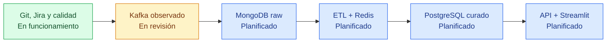

# HR Pro Data Platform

Plataforma de datos de RR. HH. en tiempo real. Consume eventos publicados en Kafka,
conserva el evento original en MongoDB y publica una vista integrada, trazable e
idempotente en PostgreSQL. Redis, métricas, API y frontend se incorporan en los
sprints posteriores definidos en Jira.

[](https://github.com/Bootcamp-IA-MAD-P7/Proyecto-DataEngineer-Grupo1/actions/workflows/ci.yml)
[](https://github.com/Bootcamp-IA-MAD-P7/Proyecto-DataEngineer-Grupo1/actions/workflows/pr-governance.yml)


## Estado verificable

| Área | Estado | Evidencia actual | Siguiente condición |
|---|---|---|---|
| Gobernanza Git y CI | En funcionamiento | PR, CODEOWNERS, etiquetas, ruleset y workflows activos | Mantener revisión de pares y checks obligatorios |
| Arquitectura y SDD | Completada | Arquitectura, ADRs, arnés y capa IA versionados | Mantenerlos al día con cada cambio de alcance |
| Conexión y observación Kafka | En revisión | HRP-28 finalizada; observación segura registrada en HRP-29 | Revisión y merge de la evidencia HRP-29 |
| Consumer Kafka | En revisión | PR limpia y configurable para HRP-30 | Validación manual contra el broker y revisión de pares |
| Contrato y modelo de datos | Preparado para continuar | Evidencia estructural disponible, sin semántica inventada | HRP-24 actualiza el contrato; HRP-25 diseña el modelo |
| Persistencia, ETL y producto final | Planificado | Sprints 2 a 6 en Jira | Desarrollo incremental por PR |

El estado del proyecto se basa en evidencias revisables, no en supuestos. Las tareas
de datos no se consideran terminadas hasta observar el broker autorizado y dejar la
evidencia versionada.

## Mapa de entrega



> Estado: Sprint 1 — descubrimiento, diseño y contrato de datos. HRP-29 ya ha
> registrado una observación estructural segura; las reglas de negocio y de
> correlación siguen pendientes de validación en HRP-24.

## Regla no negociable

El generador de datos educativo es una caja negra: **su código no se abre, lee,
inspecciona, busca, analiza ni se usa como fuente de contrato**. El repositorio
educativo solo puede obtenerse de forma operativa para ejecutar el entorno Docker
documentado; no se navegan sus archivos. Solo se usan el README público, las
instrucciones de ejecución permitidas y los mensajes realmente recibidos del broker.

## Arquitectura objetivo

```text
Kafka externo -> ingest-worker -> MongoDB (raw_events)
                                  |
                                  v
                         process-worker <-> Redis (estado temporal)
                                  |
                                  v
                           PostgreSQL (datos curados) -> API -> Streamlit

                    logs estructurados + métricas Prometheus en todos los servicios
```

La descripción completa, los límites y las decisiones viven en
[docs/01-architecture.md](docs/01-architecture.md).

## Forma de trabajo

Cada cambio recorre el mismo camino:

`Jira → spec → rama → pruebas → PR → revisión → evidencia de cierre → Jira`

- Rama de integración actual: `develop`. No se trabaja directamente sobre una
  rama de entrega.
- Una funcionalidad no empieza sin criterios de aceptación y casos de prueba.
- Un cierre de Jira debe enlazar evidencia verificable: PR, commit, prueba o
  documento.
- Las decisiones duraderas se registran como ADR; los acuerdos diarios, en
  `docs/dailies/`.

Consulta [CONTRIBUTING.md](CONTRIBUTING.md) antes de abrir una rama o una PR.

## Inicio rápido para el equipo

Tras clonar el repositorio, cada integrante debe preparar el entorno y seguir el
flujo guiado. No hace falta conocer SDD de antemano: la guía explica el orden y
proporciona prompts reutilizables.

```powershell
git clone https://github.com/Bootcamp-IA-MAD-P7/Proyecto-DataEngineer-Grupo1.git
cd Proyecto-DataEngineer-Grupo1
git switch develop
git pull --ff-only
python -m venv .venv
.\.venv\Scripts\Activate.ps1
python -m pip install -e ".[dev]"
pre-commit install
pre-commit run --all-files
pytest
```

Lee la [guía de trabajo asistido por IA](docs/onboarding/ai-assisted-workflow.md)
antes de iniciar una tarea. Incluye prompts de inicio, implementación, revisión y
cierre, y la política de no consultar el generador educativo.

## Entorno Kafka educativo

Kafka se ejecuta fuera de este repositorio, en una carpeta independiente. Una persona
del equipo puede obtener el repositorio educativo únicamente para arrancar su Compose,
sin abrir los archivos del generador:

```powershell
git clone https://github.com/Factoria-F5-madrid/data-engineering-educational-project.git kafka-educational-runtime
cd kafka-educational-runtime
docker compose up --build -d
docker compose ps
```

El puerto publicado por `docker compose ps` determina el valor local de
`KAFKA_BOOTSTRAP_SERVERS`. Nunca se versiona `.env`, no se consultan logs con
payloads y no se copian mensajes fuera de la observación estructural autorizada.
El procedimiento completo de arranque y parada está en el [runbook](docs/07-runbook.md).

## Documentación de referencia

| Necesidad | Documento |
|---|---|
| Alcance y objetivos | [Project charter](docs/00-project-charter.md) |
| Componentes y flujos | [Arquitectura](docs/01-architecture.md) |
| Contrato Kafka y reglas de evidencia | [Contrato de datos](docs/02-data-contract.md) |
| Persistencia raw y curada | [Modelo de datos](docs/03-data-model.md) |
| Método Specification-Driven Development | [Flujo SDD](docs/04-sdd-workflow.md) |
| Uso responsable de asistentes IA | [Capa agéntica y SDD](docs/ai/README.md) |
| Pirámide y matriz de pruebas | [Arnés de pruebas](docs/05-test-harness.md) |
| Métricas y operación | [Observabilidad](docs/06-observability.md) y [runbook](docs/07-runbook.md) |
| Ramas, PRs, automatizaciones y tags | [Gobernanza Git](docs/08-git-governance.md) |
| Fuentes para presentación | [Presentation sources](docs/presentation-sources/README.md) |
| Especificaciones por tarea | [docs/specs](docs/specs/README.md) |
| Acuerdos y decisiones | [ADRs](docs/adr) y [dailies](docs/dailies/README.md) |
| Onboarding y prompts del equipo | [Guía IA](docs/onboarding/ai-assisted-workflow.md) y [AGENTS.md](AGENTS.md) |

## Estructura

```text
docs/       Contratos, specs, ADRs, runbooks y dailies
src/        Aplicación Python modular
tests/      Fixtures autorizados y pruebas automatizadas
infra/      Docker Compose, configuración de servicios y monitorización
scripts/    Comandos reproducibles de desarrollo y calidad
```

## Inicio de una tarea

1. Comprueba que la tarea Jira cumple el Definition of Ready.
2. Crea o actualiza `docs/specs/HRP-XX-*.md` a partir de la plantilla.
3. Crea `feature/HRP-XX-resumen` desde `develop`.
4. Implementa el cambio y las pruebas descritas por la spec.
5. Ejecuta el arnés, abre PR contra `develop` y aporta la evidencia de cierre.
