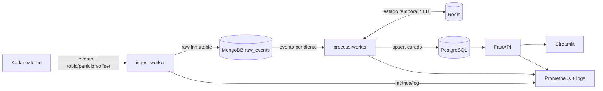

# Arquitectura de referencia

## Propósito y límite

La plataforma integra eventos de RR. HH. generados externamente. Nuestro sistema
empieza en el broker Kafka: no contiene ni controla al productor y no inspecciona el
código que crea los eventos. La arquitectura debe soportar una ingesta alta, conservar
la evidencia original, tolerar repeticiones y producir datos consultables.

## Responsabilidades y contratos

| Componente | Responsabilidad | Entrada | Salida | No responsabilidad |
|---|---|---|---|---|
| Kafka externo | Publicar eventos | — | Eventos | Garantizar el esquema final |
| `ingest-worker` | Leer, validar mínimamente y persistir raw | Evento Kafka | Documento raw y métrica | Agrupar personas |
| MongoDB | Conservación inmutable y reproceso | Evento + metadatos técnicos | `raw_events` | Consultas de negocio |
| `process-worker` | Clasificar, correlacionar, normalizar y hacer upsert | Eventos raw | Registro curado / auditoría | Exponer HTTP |
| Redis | Estado parcial con TTL | Fragmentos correlacionados | Estado temporal | Ser fuente de verdad |
| PostgreSQL | Datos curados, consistentes y consultables | Registro integrado | Tablas e índices | Retener payload raw |
| API | Consultas controladas a datos curados | HTTP | JSON | Transformar eventos |
| Dashboard | Experiencia de consulta y métricas | API / Prometheus | Vista web | Acceso directo a bases |

## Flujo lógico de datos

1. Kafka entrega un registro identificado técnicamente por `topic`, `partition` y
   `offset`.
2. El worker de ingesta añade la fecha de recepción y persiste el payload sin mutarlo
   en MongoDB. Un índice único técnico hace la operación idempotente.
   Kafka solo confirma el mensaje cuando MongoDB informa de una inserción correcta o
   de que esas mismas coordenadas técnicas ya estaban persistidas.
3. El worker de proceso recupera o recibe el evento raw, lo clasifica según el
   contrato validado y registra errores de validación sin detener la ingesta.
4. Redis guarda únicamente fragmentos necesarios para completar una persona y expira
   según una política explícita.
5. El worker publica un upsert de la persona en PostgreSQL y un registro de auditoría.
6. API y dashboard consumen PostgreSQL; jamás acceden a `raw_events` para presentar
   una consulta de negocio.

## Zonas de datos y propiedad

| Zona | Tecnología | Propietario lógico | Retención / uso |
|---|---|---|---|
| Transporte | Kafka externo | Proveedor educativo | Solo consumo |
| Raw | MongoDB | Ingesta | Auditoría, trazabilidad y reproceso |
| Temporal | Redis | Proceso ETL | Correlación de fragmentos, con TTL |
| Curada | PostgreSQL | Proceso ETL | Consultas y API |
| Operativa | Prometheus/logs | Plataforma | Métricas y diagnóstico; sin payload sensible |

## Invariantes de diseño

- Un evento raw conserva payload original y metadatos Kafka antes de transformarse.
- `topic + partition + offset` identifica unívocamente la lectura de un evento.
- Redis no puede ser necesaria para reconstruir la verdad de negocio: MongoDB y
  PostgreSQL permiten recuperar/reprocesar.
- Reprocesar un evento no puede crear una segunda persona ni duplicar una operación.
- Errores de un mensaje se aíslan, registran y miden; no detienen el consumer.
- Los nombres raw proceden de la evidencia HRP-29 y no se normalizan por intuición;
  la clave final de correlación sigue pendiente de aprobación.

## Límite de confirmación Kafka y persistencia raw

La confirmación de Kafka forma parte del contrato entre ingesta y el repositorio raw,
no de la transformación posterior. El repositorio devuelve las coordenadas realmente
persistidas y el consumer confirma únicamente esas lecturas. Un fallo de MongoDB deja
el offset sin confirmar para permitir su reentrega; una colisión con el índice único
se considera una persistencia ya realizada y sí permite confirmarlo. Clasificación,
validación de negocio y ETL se ejecutan después de este límite durable.

La decisión y sus consecuencias están registradas en
[ADR-0005](adr/0005-kafka-acknowledgement-after-raw-persistence.md).

## Escalabilidad y tolerancia a fallos

| Riesgo | Respuesta de diseño | Métrica / prueba |
|---|---|---|
| Ráfaga de eventos | Consumer por grupo, lotes y persistencia idempotente | Mensajes/s y lag |
| Mensaje duplicado | Índice único raw y upsert curado | Duplicados descartados |
| Orden variable | Estado parcial en Redis y reglas de correlación | Fixture reordenado |
| Base temporal caída | Reintento acotado; evento raw recuperable | Errores de persistencia |
| Esquema inesperado | Envío a `invalid_events` / auditoría | Conteo de inválidos |
| Reinicio del worker | Relectura segura desde offset y deduplicación | Prueba de reinicio |

## Despliegue progresivo

| Nivel del briefing | Servicios habilitados | Evidencia de aceptación |
|---|---|---|
| Esencial | Kafka, ingest-worker, MongoDB, process-worker, PostgreSQL | Kafka → raw → persona curada |
| Medio | Docker Compose, logs, tests, CI | `docker compose` y arnés en verde |
| Avanzado | Redis, Prometheus, API | Métricas y consultas HTTP |
| Experto | Reinicio automático y Streamlit | Pipeline continuo y demo navegable |

## Decisiones asociadas

- [ADR-0001](adr/0001-monolito-modular.md): monolito modular con workers.
- [ADR-0002](adr/0002-raw-and-curated-storage.md): datos raw y curados separados.
- [ADR-0003](adr/0003-evidence-first-data-contract.md): contrato basado en evidencia.
- [ADR-0004](adr/0004-configuration-and-secrets.md): configuración y secretos externos.
- [ADR-0005](adr/0005-kafka-acknowledgement-after-raw-persistence.md): confirmación Kafka
  después de persistir raw.
