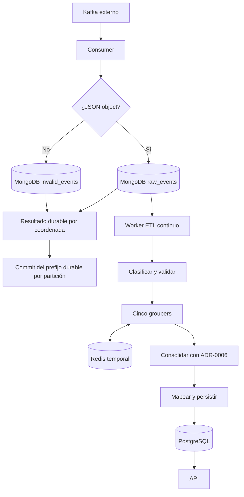

# Arquitectura y límites de ejecución

**Corte:** 2026-09-08 · código `f3a952b`. Esta guía describe componentes existentes
y cómo se conectan realmente. [Aceptación del proyecto](delivery-evidence.md).

## Procesos ejecutables

| Proceso | Entrada | Trabajo real | Fin |
|---|---|---|---|
| `ingestion.main` / Compose `app` | Kafka autorizado | Polling, persistencia raw, confirmaciones y métricas | Señal o error con reintentos acotados |
| `transformation.main` / Compose `etl` | MongoDB `raw_events` pendiente | Clasificar, correlacionar en Redis y persistir el modelo curado | Señal; espera entre lotes vacíos |
| `storage.main` | Configuración PostgreSQL | Conectar y crear esquema | Termina; no hace ETL |
| `uvicorn ...api.main:app` / Compose `api` | HTTP | Consultas PostgreSQL | Señal |

La misma imagen se reutiliza con tres comandos explícitos en Compose. El perfil
`app` conecta la ingesta, el worker ETL y la API; Kafka sigue siendo el runtime
educativo externo y el frontend permanece fuera del alcance.

## Recorrido del dato

HRP-71 conserva su alcance histórico: usa coordenadas y datos sintéticos y llama
directamente a MongoDB, ETL y SQL. La extensión de runtime de HRP-87 añade el
recorrido continuo real desde los documentos RAW que crea el consumer.

## Contratos entre componentes

| Componente | Contrato | Límite |
|---|---|---|
| MongoDB | Payload original, coordenadas y estado técnico | No clasifica negocios |
| Clasificador | Igualdad exacta del conjunto de claves | Ignora valores; extra/missing key → `unknown` |
| Validador | Mapping soportado y clasificación coherente | No limpia ni normaliza valores |
| Groupers | Grupos por clave operacional y procedencia | Conservan conflictos y no resueltos |
| Consolidación | Componentes conectados por cuatro reglas exactas | No prueba identidad real |
| Redis | Set de fragmentos clasificados bajo hash SHA-256 con TTL | Estado temporal reconstruible desde RAW; no contiene PII en la clave |
| SQL | Mapeo, transacción y auditoría de referencias | Idempotencia de procedencia, no unicidad de pasaporte |
| API | Consultas exactas parametrizadas y paginadas | No ingiere ni consolida |

## Correlación y conservación de evidencia

ADR-0006 admite relaciones exactas Personal–Bank por pasaporte,
Personal–Location por nombre concatenado, Location–Professional por nombre y
Location–Net por dirección. No se usa fuzzy matching ni normalización.
La consolidación conserva grupos originales, reglas aplicadas y referencias.

`complete` significa que el componente tiene contribuciones de los cinco dominios
sin ambigüedad detectada; no significa persona real verificada.
`incomplete`, `ambiguous` y `unresolved` no se ocultan con valores inventados.
[Contrato vigente de consolidación](specs/HRP-96-consolidation-contract-hardening.md).

## Durabilidad y recuperación

La implementación de HRP-34 reconoce resultados durables por coordenada y confirma
solo el prefijo contiguo por topic-partition. Un conflicto o fallo no autoriza
avanzar sobre esa coordenada. Esto evita confirmar escrituras no reconocidas,
pero no constituye una garantía exactly-once global ni una prueba de tolerancia
a cualquier carrera entre procesos.

Redis renueva TTL al almacenar. No hay transacción atómica conjunta `SADD+EXPIRE`
en el adapter; los errores se propagan. El worker reconstruye componentes desde
fragmentos RAW nuevos y estado temporal, pero no se acredita recuperación ante
desastres ni alta disponibilidad.

## Observabilidad

El proceso de ingesta expone tres familias de métricas a Prometheus.
Grafana visualiza consumo y duraciones de ingesta/MongoDB. No hay instrumentación
Prometheus de SQL, Redis o API en el código revisado.
[Catálogo exacto](06-observability.md).

## Decisiones y alcance futuro

- [ADR-0001](adr/0001-monolito-modular.md): monolito modular.
- [ADR-0002](adr/0002-raw-and-curated-storage.md): raw y curado.
- [ADR-0003](adr/0003-evidence-first-data-contract.md): evidencia antes de semántica.
- [ADR-0004](adr/0004-configuration-and-secrets.md): configuración externa.
- [ADR-0005](adr/0005-kafka-acknowledgement-after-raw-persistence.md): política de confirmación.
- [ADR-0006](adr/0006-person-correlation-key.md): correlación operacional.
- [ADR-0007](adr/0007-accessibility-and-sustainable-delivery.md): accesibilidad y sostenibilidad.

Frontend y AWS son direcciones futuras, no despliegues entregados. El runtime local
entregado contiene `app`, `etl` y `api` como servicios separados.

## Límite adicional del acknowledgement

El helper de prefijo durable opera por lote y partición. No mantiene un registro
de huecos pendientes entre lotes. Tras un resultado no persistido, un lote posterior
puede permitir un commit más avanzado: esta revisión no acredita ausencia global
de pérdida ni recovery completo. No convertir las pruebas locales del helper en
una garantía extremo a extremo. Corregir esta condición requeriría trabajo funcional.
