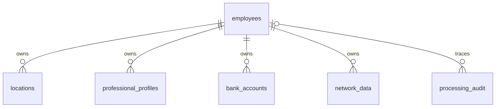

# Data model and field dictionary

**Reviewed:** 2026-09-08. Runtime truth: [schema](../src/hr_pro_platform/storage/postgres.py),
[mapper](../src/hr_pro_platform/storage/person_mapper.py) and
[repository](../src/hr_pro_platform/storage/person_repository.py).
HRP-25/52 preserve the original design, not a current “SQL not implemented” status.

## MongoDB

Two implemented collections, configurable through `MONGODB_COLLECTION` and
`MONGODB_INVALID_COLLECTION`, use `raw_events` and `invalid_events` in .env.example; ingestion requires
both configuration values rather than silently supplying runtime defaults.

| Field | Shape / meaning |
|---|---|
| `payload` | Original JSON object; technical-invalid payload uses original binary or null |
| `topic`, `partition`, `offset` | Technical Kafka identity |
| `received_at` | UTC receipt timestamp |
| `processing_status` | Initial state `pending` for raw; `invalid` for technical-invalid; not Jira status |
| Invalid reason | `missing_value`, `invalid_utf8`, `invalid_json`, `non_object_json` |

Each collection has the compound technical unique index. The adapter checks
opposite-collection conflicts. No MongoDB `processing_audit` collection is
implemented by this boundary; operational SQL auditing is a separate table.
Unknown structural JSON objects remain raw, not technical-invalid events.

## PostgreSQL structure

| Table | Columns beyond primary key |
|---|---|
| employees | first_name, last_name, sex, telephone_number, email, passport, created_at, updated_at |
| locations | employee_id, full_name, city, address, ip_v4 |
| professional_profiles | employee_id, full_name, company, company_address, company_email, company_telephone_number, job |
| bank_accounts | employee_id, iban, passport, salary |
| network_data | employee_id, ip_v4 |
| processing_audit | employee_id (nullable), stage, status, raw_event_ref, occurred_at |

Primary keys are BIGSERIAL; foreign keys are BIGINT. Business fields are nullable
TEXT, except `sex` (JSONB). Timestamps are TIMESTAMPTZ.
Dependent rows use `ON DELETE CASCADE`; audit ownership uses `ON DELETE SET NULL`.
Ownership columns and audit timestamps have the required constraints in the schema.

A partial unique index protects non-null `processing_audit.raw_event_ref`.
There is no business unique index on passport, name, address or IBAN.
The schema initializer uses `CREATE ... IF NOT EXISTS`; it is not a versioned
migration framework and does not reconcile incompatible existing table definitions.

## Observed-to-curated mapping

| Domain | Observed field → curated field |
|---|---|
| Personal | name → first_name; last_name → last_name; sex → sex; telfnumber → telephone_number; email → email; passport → passport |
| Location | fullname → full_name; city → city; address → address |
| Professional | fullname → full_name; company → company; company address → company_address; company_email → company_email; company_telfnumber → company_telephone_number; job → job |
| Bank | IBAN → iban; passport → passport; salary → salary |
| Net | IPv4 → ip_v4; address participates in correlation, not a network_data column |

The mapper also supports Location `IPv4 → ip_v4`, but the current exact
Location classifier accepts only fullname/city/address. The column must not be
advertised as normally populated by the observed Location contract.
Salary remains TEXT; there is no currency conversion or numeric salary validation.

## Transformation and persistence semantics

The consolidated record carries domain contributions, correlation rules,
provenance and status (complete/incomplete/ambiguous). Mapping preserves candidate
rows and source references. Repository insert/update operations enforce their own
rejection and idempotency policy; consult HRP-56/57/58 for ambiguous or unresolved
ownership cases. Repeated payload with different source reference is not equivalent
to repeating the same exact payload/reference pair.

## Redis

Keys use `hrp:partial:<opaque component identifier>`. Members contain classification,
payload and source_reference serialized deterministically. Set membership deduplicates
identical serialized fragments; conflicts remain distinct. Default TTL is 3600s,
renewed after every storage call, including duplicates. Retrieval does not refresh TTL.
Redis is internal to Compose without a host port or durable volume.

## Privacy and consumers

Search API returns employee, location and professional data, not bank accounts.
Statistics may count bank rows but do not expose IBAN or salary.
Use synthetic examples only. [API contract](api-reference.md).
