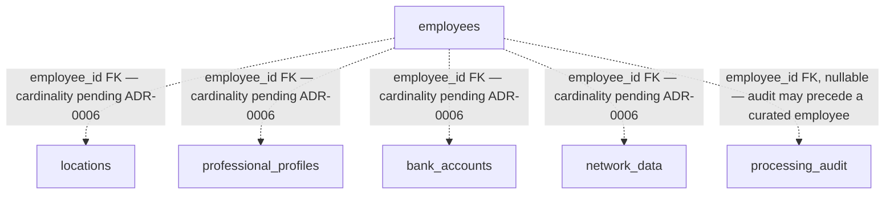

# HRP-52 — Design PostgreSQL tables and relationships

**Status:** Draft; documentary implementation authorised
**Owner:** Johans
**Human reviewer:** Miguel
**Jira:** HRP-52
**Dependencies:** HRP-25 merged and available on `develop` (PR #18, PR #19); ADR-0006 open as `Proposed`
**Related ADR:** `docs/adr/0002-raw-and-curated-storage.md`, `docs/adr/0006-person-correlation-key.md`
**Planned branch:** `feature/HRP-52-tablas-relaciones`

## Objective

Formalise the PostgreSQL curated tables already proposed in HRP-25 into an explicit
relational design: primary keys, candidate foreign keys, candidate indexes and
naming conventions — documented and human-reviewable, without writing SQL and
without resolving anything HRP-25/ADR-0006 left open. This task designs the
relationships; it does not create them.

## Context and scope

### Includes

- A primary-key strategy for every curated table listed in HRP-25
  (`employees`, `locations`, `professional_profiles`, `bank_accounts`,
  `network_data`, `processing_audit`).
- Candidate foreign-key relationships between those tables, restated from HRP-25 with
  explicit constraint names and `ON DELETE`/`ON UPDATE` behaviour proposals.
- Candidate technical indexes (foreign-key support indexes), clearly separated from
  any business-uniqueness index, which remains out of scope until ADR-0006 is
  accepted.
- A relationship diagram showing candidate links and marking every link whose
  cardinality depends on ADR-0006 as pending.
- A naming convention for tables, columns, primary keys and foreign keys, to keep
  HRP-54's implementation consistent.

### Excludes

- SQL DDL, migrations, Docker, ETL code, API code or any executable artifact — that
  is HRP-54 (tables/keys/indexes) and HRP-53 (Docker).
- A definitive person-correlation key, cardinality or conflict-resolution rule:
  ADR-0006 remains `Proposed` and this spec does not change that status.
- Any unique business constraint (e.g. on `passport`, `fullname`, `address`, `iban`).
- New fields, types or business semantics beyond what HRP-24/HRP-25/HRP-29 already
  evidence.
- Any reading, cloning or inspection of the educational data generator.

### Verifiable assumptions

- `docs/specs/HRP-25-modelo-datos.md` is merged into `develop` (PR #18, approved by
  Anahí; English translation in PR #19) and is the only source of candidate
  PostgreSQL columns used here. No column is introduced that HRP-25 does not already
  list.
- `docs/adr/0006-person-correlation-key.md` is `Proposed`, not `Accepted`. Any
  relationship whose cardinality would depend on a correlation key is documented as
  `pending` here, exactly as HRP-25 left it.
- HRP-52 has no formal "blocked by" link in Jira, but its own comment thread (Miguel
  Redondo Núñez: "El diseño SQL debe ser coherente con el modelo global de MongoDB y
  PostgreSQL") makes HRP-25 an accepted precondition. HRP-52 is the parent of
  HRP-53 (Docker) and blocks HRP-54 (create tables/keys/indexes): neither should
  start from this design until it receives human review.

### Risks

- A future ADR-0006 decision may require adding a unique constraint or a linking
  table not anticipated here, so HRP-54 should treat these foreign keys as a
  starting point, not a final schema freeze.
- Choosing a technical primary-key type (see "Primary-key strategy") now is a
  reversible implementation default, not a business decision; it may still need
  revisiting once real load or volume evidence exists.

## Design

### Primary-key strategy

Every curated table uses a surrogate primary key, consistent with HRP-25 (no
observed field is unique enough to serve as a natural key).

| Decision | Recommendation | Why it is spec-level, not ADR-level |
|---|---|---|
| Key type | `BIGSERIAL` / `IDENTITY` sequential integer | Simple, sufficient for the current scale, and reversible: switching to UUID later is a migration, not an architecture change |
| Key name | `id` on every table | Matches HRP-25's existing column list |

This is a recommended default for HRP-54 to implement, not an invariant; it can be
revisited in a future spec without an ADR because it does not encode a business rule
or a correlation decision.

### Candidate relationships

Every edge above is a candidate foreign key, not an approved cardinality. HRP-25
already established that whether an employee has one or many rows in `locations`,
`professional_profiles`, `bank_accounts` or `network_data` depends on a correlation
and grouping decision that ADR-0006 has not made. This diagram does not resolve
that; it only names the candidate link so HRP-54 has a starting point.

### Foreign keys and indexes per table

| Table | Candidate primary key | Candidate foreign key(s) | Candidate technical index(es) | Notes |
|---|---|---|---|---|
| `employees` | `id BIGSERIAL PK` | — | none beyond the primary key | No unique index on `passport`: it is a correlation candidate only (`docs/02-data-contract.md`) |
| `locations` | `id BIGSERIAL PK` | `employee_id` → `employees.id`, `ON DELETE CASCADE` (candidate) | non-unique index on `employee_id` | `ON DELETE CASCADE` is a candidate default so an employee's dependent rows do not become orphaned; confirm in HRP-54 once upsert behaviour is designed |
| `professional_profiles` | `id BIGSERIAL PK` | `employee_id` → `employees.id`, `ON DELETE CASCADE` (candidate) | non-unique index on `employee_id` | Same candidate default as `locations` |
| `bank_accounts` | `id BIGSERIAL PK` | `employee_id` → `employees.id`, `ON DELETE CASCADE` (candidate) | non-unique index on `employee_id` | No unique index on `iban` or `passport`: both remain correlation/format candidates, not confirmed keys |
| `network_data` | `id BIGSERIAL PK` | `employee_id` → `employees.id`, `ON DELETE CASCADE` (candidate) | non-unique index on `employee_id` | HRP-25 leaves open whether this table survives as separate from `locations`; this row assumes it does, pending that decision |
| `processing_audit` (curated-side) | `id BIGSERIAL PK` | `employee_id` → `employees.id`, nullable, `ON DELETE SET NULL` (candidate) | non-unique index on `employee_id`; non-unique index on `occurred_at` for audit queries | Nullable FK matches HRP-25: an audit entry may exist before a curated employee record does |

No table above declares a `UNIQUE` constraint on any column. This restates, at
relationship level, the same rule HRP-25 already set: `passport`, `fullname`,
`address` and `iban` are correlation or format candidates only, and a `UNIQUE`
constraint on any of them would encode a business rule ADR-0006 has not approved.

`ON DELETE`/`ON UPDATE` behaviour is proposed as a reversible implementation
default, matching the "spec-only, no ADR" pattern from HRP-25: it can change during
HRP-54's implementation without requiring an ADR, as long as it does not introduce a
business uniqueness or correlation rule.

### Naming convention (for HRP-54 to follow)

- Tables: lowercase, plural, `snake_case` (already the case in HRP-25: `employees`,
  `locations`, …).
- Primary keys: `id`.
- Foreign keys: `<referenced_table_singular>_id` (e.g. `employee_id`).
- Foreign-key constraints: `fk_<table>_<referenced_table>` (e.g.
  `fk_locations_employees`).
- Indexes: `ix_<table>_<column>` (e.g. `ix_locations_employee_id`).

This convention is cosmetic and reversible; it does not require an ADR and can be
adjusted in a follow-up spec if HRP-54 finds a naming collision or a project-wide
convention is adopted elsewhere.

### What remains explicitly out of this design

- The person-correlation key and any resulting unique constraint (ADR-0006).
- The true cardinality of `employees` to `locations` / `professional_profiles` /
  `bank_accounts` / `network_data` (depends on ADR-0006).
- Whether `network_data` stays a separate table or folds into `locations` (HRP-25,
  still open).
- Representation of `sex` (observed as a JSON array) and the storage type of
  `salary` (observed as a string) — both `pending` in HRP-25 and unchanged here.

## Acceptance criteria

- [ ] HRP-25 is confirmed merged into `develop` and used as the only source of
      candidate PostgreSQL columns for this design.
- [ ] ADR-0006 is confirmed still `Proposed`, and no relationship or constraint in
      this spec assumes it were `Accepted`.
- [ ] Every table from HRP-25 has a documented candidate primary key.
- [ ] Every candidate foreign key names its source and target table, and is marked
      as a candidate rather than an approved cardinality.
- [ ] No unique constraint is proposed on `passport`, `fullname`, `address`, `iban`
      or any other correlation/format candidate field.
- [ ] Candidate indexes are limited to foreign-key support; no business-uniqueness
      index is introduced.
- [ ] A naming convention is documented for HRP-54 to follow.
- [ ] The spec explicitly states it does not authorise SQL, Docker, ETL or API
      implementation, and names HRP-54 and HRP-53 as the tasks that do.
- [ ] No payload value, PII, secret or generator reference appears anywhere in this
      document.
- [ ] `docs/03-data-model.md` references this spec alongside HRP-25.

## Accessibility and sustainability applicability

- Accessibility: not applicable. This task produces a documentary relational design
  with no implemented user-facing flow, UI component or rendered interface.
- Sustainability: not applicable in the mandatory implemented-flow sense of
  ADR-0007, since no code, API, Docker or deployment artifact is produced here.
  As a design note only: proposing surrogate integer keys instead of UUIDs, and
  foreign-key support indexes instead of broader indexing, favours a smaller
  storage/index footprint for HRP-54 to implement — this is a design preference, not
  measured evidence.
- Deferred claims: none. No accessibility conformance, carbon, energy or deployment
  claim is made by this spec.

## Test strategy

| Level | Case | Expected evidence |
|---|---|---|
| Documentary | Every candidate column/table traces to `docs/specs/HRP-25-modelo-datos.md` | Manual cross-check against HRP-25 |
| Traceability | Every foreign key and index states why it is a candidate, not an approved rule | Manual review |
| Boundary review | No unique constraint or index encodes an unapproved correlation/business rule | Manual review against ADR-0006 |
| Security review | No payload value, PII, secret, `.env` content or generator reference | Manual review |
| Quality | `python scripts/validate_specs.py` and `pre-commit run --all-files` | Commands pass with no unrelated changes |
| Human review | Miguel reviews the documentary diff for coherence with the global MongoDB/PostgreSQL model, per his HRP-52 comment | Approval recorded in the PR before any next step |

## Closing evidence

- Branch / PR: `feature/HRP-52-tablas-relaciones` / pending.
- Commit: pending.
- Updated data model: pending (this PR).
- Validation commands and results: pending.
- Human reviewer approval: pending.
- Jira closing comment: pending; closure is not authorised by this draft.
